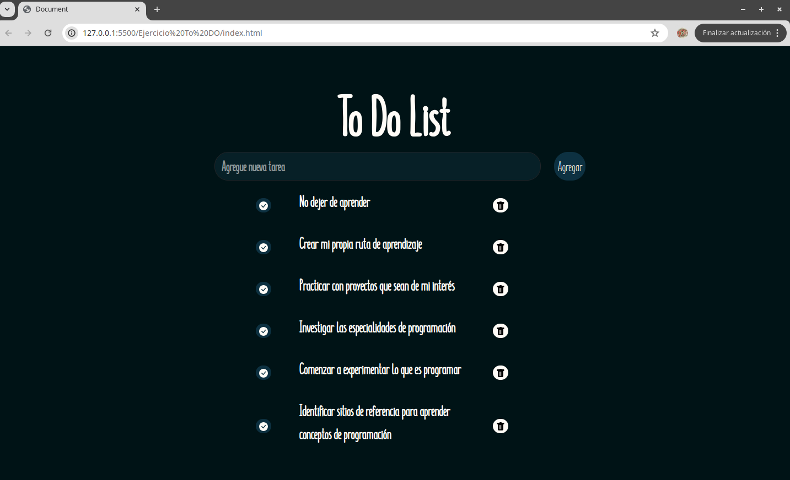

# TO-DO-DOM
Creacion de un To Do con HTML, CSS y Javascript.

Permite agregar una lista de tareas a realizar 

# Website DEMO

# Tareas agregadas

# Tareas agregadas ya realizadas

# Eliminar tareas ya realizadas 

